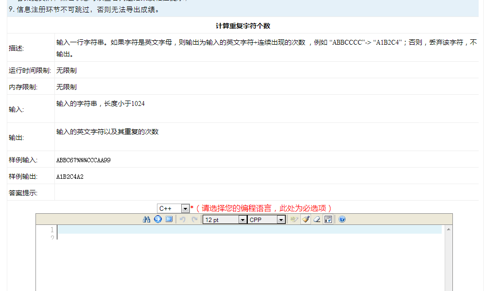
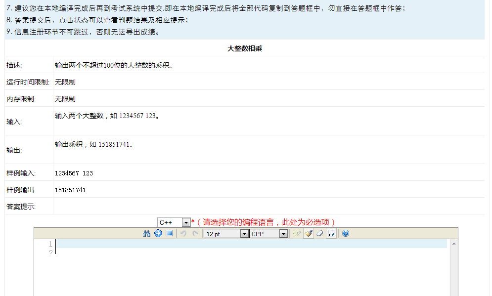
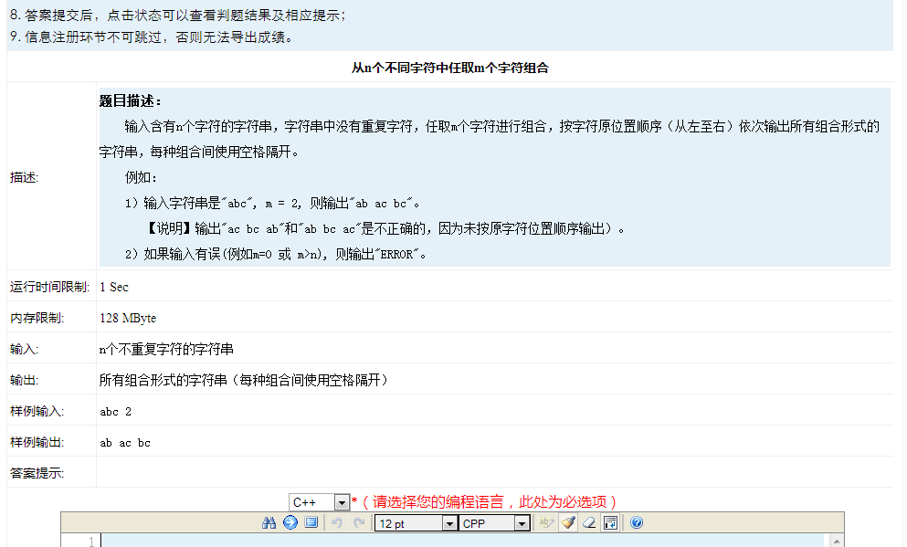

# huawei-program-test

#### 计算重复字符个数



```c
#include <stdio.h>
#include <string.h>

void Count_Character(const char *src,const char Character){
    int num = 0;
    while(*src != '\0'){
        if(Character == *src++){
            num++;
        }
    }
    if(num != 0){
        printf("%c%d",Character,num);
    }

}

void Count_repeatC(const char *src){
    unsigned int num = 0;
    char temp = *src;
    while(*src != '\0'){
        if((temp >= 'A' && temp <= 'Z') || (temp >= 'a' && temp <= 'z')){
            while(temp == *src){
                num++;
                src++;
            }printf("%c%d",temp,num);
            temp = *src;
            num = 0;
        }
        else{
            src++;
            temp = *src;
        }

    }printf("\n");
}

int main(void){
    char src[1024];
    printf("Enter a string: ");
    scanf("%s",&src);
    char Character_a = 'a';
    char Character_A = 'A';
    for(int i = 0; i<26; i++){
        Count_Character(src,Character_a+i);
        Count_Character(src,Character_A+i);
    }printf("\n");
    Count_repeatC(src);
    return 0;
}
```

#### 大整数相乘



```c
#include<stdio.h>
#include<string.h>
#include<malloc.h>

#define and &&           /**************/
#define or ||            /* python风格 */
#define not !            /*            */
#define Int(X) (X - '0') /**************/

int *multiBigInteger(const char *, const char *);
int checkNum(const char *);

int main(void)
{
    char num1[100] = {'\0'}, num2[100] = {'\0'};
    printf("Please input two nunber(less than 100 digits):\n> ");
    while(scanf("%s%s", num1, num2) != EOF)
    {
        int *result = NULL;
        int i, change = 0;
        //对输入的数据进行检验
        if(strlen(num1) > 100 or strlen(num2) > 100)
        {
            printf("per number must less than 100 digits\n");
            return 1;
        }

        if(checkNum(num1) or checkNum(num2))
        {
            printf("ERROR: input must be an Integer\n");
            return 1;
        }

        printf("num1:\t%s\nnum2:\t%s\n", num1, num2);

        result = multiBigInteger(num1, num2);

        /* 输出结果result，result[0]保存着result的长度，
         * 所以下标要从1开始 */
        printf("result:\t");
        for(i = 1; i <= result[0]; i++)
        {
            if(result[i] != 0) //这一步用来去掉前导0,第一位为0跳过不输出
                change = 1;
            if(not change)
            {
                if(i > 1)        //这一步用来判断结果是否为0,
                    {                //如果结果第二位还是0,就判断为0
                        printf("0");
                        break;
                    }
                continue;
            }
            printf("%d", result[i]);
        }
        printf("\n");
        printf("\nPlease input two nunber(less than 100 digits):\n> ");
    }
    return 0;
}

//用于检测输入的是否是数字，如果是就返回0,不是就返回1
int checkNum(const char *num)
{
    int i;
    for(i = 0; (size_t)i < strlen(num); i++)
    {
        if(num[i] < '0' or num[i] > '9')
        {
            return 1;
        }
    }
    return 0;
}

//返回结果result，为一片内存块，类似数组
int *multiBigInteger(const char *num1, const char *num2)
{
    int *result = NULL;                //用来保存最终结果
    int num1Len = strlen(num1);        //num1的长度
    int num2Len = strlen(num2);        //num2的长度
    int resultLen;                     //结果的最大长度
    int i, j;                          //循环计数器
    resultLen = num1Len + num2Len;     //结果长度最大为num1长度和num2长度之和
    //初始化result为0
    result = (int *)malloc((resultLen+1)*sizeof(int));
    memset(result, 0, (resultLen+1)*sizeof(int));

    result[0] = resultLen; //result的第一位是用来保存result的长度的。
    /* num1乘以num2,由于这里采用先不进位的算法，所以算法是按从左到右
     * 按顺序来乘，然后将每位的结果保存到result的每一位中，循环一次
     * reult就从下一位开始求和。如下：(左边为正常算法，右边为本程序算法)
     *
     *     54321     |     54321
     *    ×  123     |    ×  123
     *    -------    |   --------
     *    162963     |     54321
     *   108642      |     108642
     *   54321       |      162963
     *   --------    |   ---------
     *   6681483     |     6681483
     *
     * */
    for(j = 0; j < num2Len; j++)
    {
        for(i = 0; i < num1Len; i++)
        {
            /* result第一位是用来保存result长度的，而第二位是保存结果最后的进位的
             * 没有进位，则result[1]为0，所以每位相乘之和是从第三位（即result[2]）
             * 开始。这里是本程序的比较巧妙的地方，需要仔细想想。
             * */
            result[i+j+2] += Int(num1[i]) * Int(num2[j]);
        }
    }

    /* 这个循环用来处理进位的，所以要从result的最后一位一直处理到首位。
     * 要注意result的总长度是resultLen+1,有一位是保存result的长度，而
     * C语言下标是从0开始，所以result的最后一位的下标就是resultLen，而
     * 第一位就是1。*/
    for(i = resultLen; i > 1; i--)
    {
        result[i-1] += result[i]/10;
        result[i] = result[i]%10;
    }
    printf("num1Len:%d\nnum2Len:%d\n", num1Len, num2Len);
    return result;
}

```

#### 从n个字符中去m个字符的组合



```c
#include <stdio.h>
#include <string.h>
/** \brief
 *
 * \param  src    源字符
 * \param  result 结果
 * \param  n      匹配格式
 * \return void
 *
 */

void combine(const char *src, char *result, int n)
{
    int i,j,len = strlen(src);
    if (n == 0){
        printf("%s\t",result);
    }
    else{
        for (j = 0; *(result + j) != '\0'; j++);
        for (i = 0; i < len; i++){
            *(result + j) = *src;
            *(result + j + 1) = '\0';
            src++;
            combine(src, result, n - 1);
        }
    }
}

int main()
{
    int n = 0;  //匹配格式
    char src[100], result[100];
    for (int i = 0; i < 100; i++){ //字符串初始化赋值
        src[i]    = '\0';
        result[i] = '\0';
    }
    cin >> src;  //请求输入字符串
    cin >> n;    //请求输入匹配格式

    if (n > 0 && strlen(src) > 0 && n <= (int)strlen(src))
        combine(src, result, n);
    return 0;
}
```


