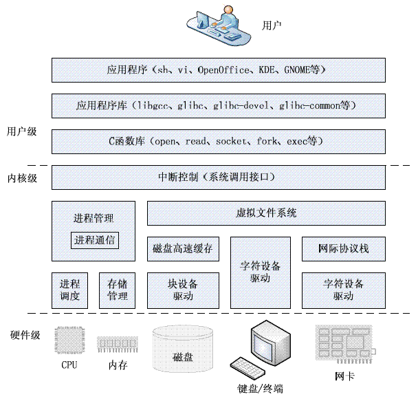
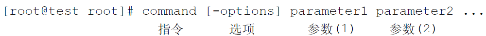
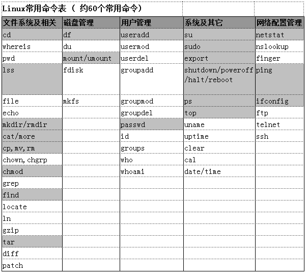

# Sundy-Android嵌入式底层课程

## S1_Linux操作系统基础和语言基础

### L1_Linux基础及操作系统框架概述

课程目标：了解Linux操作系统设计结构了解Linux操作系统的基本概念，包括文件系统，进程等熟练进行Linux操作系统的安装熟悉VMWare工具，并且以它为基础来安装操作linux熟悉Linux文件目录熟悉通用文件系统结构
重点难点：Linux操作系统设计结构Linux目录结构通用文件系统的结构
考核目标：
课后练习：安装UBUNTU
小贴士/名词解释:文件系统文件系统元数据(Meta Data)EXT3SWAPNAT(网络地址转换）
参考课时：
推荐书籍：《鸟哥私房菜》

### 1 我们要遇到一个操作系统-设计和选择

### 2 Linux操作系统的核心架构

### 3 Linux操作系统的特点

##### 什么是文件系统

文件系统是一种存储和组织计算机文件和资料的方法

##### 文件系统通用结构

引导块、超级块、inode区以及数据区

##### 文件系统分类

磁盘文件系统NTFS,EXT3
闪存文件系统JFFS2,YAFFS
数据库文件系统BFS,WINFS
网络文件系统NFS
虚拟文件系统VFS(Proc)

##### EXT3,SWAP

Linux文件及文件系统

Linux中一切皆文件

##### Linux中文件类型：

目录文件 d
链接文件 l
块设备 b
字符设备 c
socket s
管道 p

##### Linux文件颜色：

蓝色-目录
绿色-可执行文件
红色-压缩文件
浅蓝色-链接文件
灰色-其它文件

##### Linux目录结构

/bin 存放系统可执行文件
/sbin 存放管理员用的可执行文件
/etc 配置文件
/lib 共享类库
/dev 设备
/tmp 临时文件
/boot 启动
/root root用户目录
/mnt 挂载目录
/opt 优化目录
/usr 用户程序目录
/usr/bin (sbin) ， 用户的可执行文件目录
/var 系统变量
/proc 虚拟文件系统 VFS
/lost+found ， 找回文件
/home 用户文档
/home/sundy

## L2_Linux命令类库机制及常用命令

课程目标：了解什么是Linux Shell 以及Shell的设计原理熟悉Shell常用命令，Shell分类清晰掌握Shell命令自我学习方法
重点难点：Shell设计原理，Shell类库
考核目标：
课后练习：下载Bash和Coreutils ， 配置，编译试着解读一下ls命令源代码
小贴士/名词解释:Shell
参考课时：1
推荐书籍：

#### Show第一个命令：ls

linux是如何实现这个ls的呢？

2 还记得Windows Command么？

3 Linux也需要命令，事实上Linux一开始是没有图形的

### Shell的诞生

3.2 我们来看看Linux是如何实现shell的 

##### Bash

##### Coreutils

*Coreutils* 软件包包括一整套基本的 shell 工具。 是GNU提供了一整套比较基本的工具软件包,是这些工具的集合。

##### GNU

GNU是“GNU's Not Unix”的递归缩写
GNU计划，又称革奴计划，是由Richard Stallman在1983年9月27日公开发起的。它的目标是创建一套完全自由的操作系统。

【历史】
1985年Richard Stallman又创立了自由软件基金会（Free Software Foundation）来为GNU计划提供技术、法律以及财政支持。　　
到了1990年，GNU计划已经开发出的软件包括了一个功能强大的文字编辑器Emacs。GCC（GNU Compiler Collection，GNU编译器集合），是一套由 GNU 开发的编程语言编译器。以及大部分UNIX系统  GNU操作系统的内核Linux的程序库和工具。唯一依然没有完成的重要组件就是操作系统的内核(称为HURD)。
1991年Linus Torvalds编写出了与UNIX兼容的Linux操作系统内核并在GPL条款下发布。Linux之后在网上广泛流传，许多程序员参与了开发与修改。1992年Linux与其他GNU软件结合，完全自由的操作系统正式诞生。该操作系统往往被称为“GNU/Linux”或简称Linux。（尽管如此GNU计划自己的内核Hurd依然在开发中，目前已经发布Beta版本。）
许多UNIX系统上也安装了GNU软件，因为GNU软件的质量比之前UNIX的软件还要好。GNU工具还被广泛地移植到Windows和Mac OS上。

　　GNU 包含3个协议条款，
　　GPL3：GNU通用公共许可证（GNU General Public License）
　　LGPL：GNU较宽松公共许可证 (GNU Lesser General Public License）, ) ，现在的apache license 也是基于它发展而来的 。
　　GFDL ： GNU自由文档许可证（GNU Free Documentation License ）的缩写形式。

##### FSF

1985年Richard Stallman又创立了自由软件基金会（Free Software Foundation）来为GNU计划提供技术、法律以及财政支持。

##### 命令格式

注意大小写识别

6.1.2 命令行编辑

6.1.3 Shell特殊字符

通配符
管道 Pipe : 吧前面进程的输出作为后面进程的输入 ， 把前面文件的输出做为后面进程的输入
输入/输出重定向

 `>` `>>` `<` `<<`

##### 帮助命令

man
info

man info的区别：
Man工具就是系统帮助手册
Info工具是一个基于菜单的超文本系统，由GNU项目开发并由Linux发布。info工具包括一些关于Linux shell、工具、GNU项目开发程序的说明文档。

cat -n [file]
cat -b [file]

rm -f
rm -r 

chmod 777 [file]
chmod a+x [file] (a,u,g,o)

grep "keywords" [path][file]

find [path] -name "keywords"

updatedb
locate [filename]

ln -s [sourcefile] [desfile]
ln -h ...
软硬链接之分

压缩：gzip [filename]
解压缩：gzip -d [filename]

压缩：tar -czvf [desfile] [sourcefile]
解压缩：tar -xzvf [sourcefile]

diff -y [file1][file2]
diff -u [file1][file2]
制作补丁文件
diff -Nu [file1][file2] > [patchfile]

patch -p[n] < [patchfile]

df  [Disk Free]

du [disk usage]
du
du -sh

fdisk  [format disk]
fdisk -l

先说说现在要了解的设备符号 hd*[IDE] sd* [SCSI]
hda ,hdb , hdc 的关系
hda1,hda2,hda3 的关系

对磁盘进行分区

mkfs  [make file system]

查看当前mount信息
mount
装载设备
mount -t [dev][path]
卸载设备
umount [path]

/etc/fstab

再说说最简单的vmware和windows共享hgfs

实验一：挂载硬盘
实验二：挂载usb
实验三：挂载img

##### 用户管理

6.5.1 passwd

/etc/passwd

注册名：口令：用户标识号：组标识号：用户名：用户主目录：命令解释程序

/etc/shadow

注册名：加密后口令：密码最近更改天数(1970.1.1为参照）:多少天内不能更改：多少天内必须更改：提前提醒修改密码的天数

6.5.2 useradd / adduser

常用命令：
注意，默认情况不会添加home目录
useradd -m [username]
useradd -p 
useradd -g

给大家讲一个故事 ：
现在程序安装有时候是需要系统管理员授权的
授权后，我们编写一个shell执行一下：
useradd -u 0 -o -g root -p [password] [username]

6.5.3 usermod

6.5.4 userdel / deluser

注意：
默认情况不会删除 工作目录 /home/[user]
需要用 userdel -r [user]

6.5.5 groupadd

6.5.6 groupmod

主要就是更改 /etc/passwd内容
测试更改一下新建用户的home路径

6.5.7 groupdel

6.5.8 id

6.5.9 groups

6.5.10 who

6.5.11 whoami

6.6 系统及其它

6.6.1 su

[switch user] 

6.6.2 sudo

[super user do]

6.6.3 export

仅限于本次登录
export PATH=$PATH:/home/sundy

变量，特别是环境变量，比如PATH
那什么是$PATH呢？ shell中的变量调用符号
举例...

 

6.6.4 shutdown / poweroff / halt / reboot

shutdown -h now 
shutdown -r now

6.6.5 ps

[Processes Snapshot]
ps -ef
ps -aux

6.6.6 kill

kill [pid]

6.6.7 top

介绍一下 Priority 与 nice value 关系

f键自定义列

6.6.8 free

6.6.9 uname

6.6.10 uptime

6.6.11 clear

6.6.12 cal

6.6.13 date / time

6.7 网络配置管理

6.7.1 netstat

常用的网络状态：
LISTEN ：在监听状态中。  
ESTABLISHED：已建立联机的联机情况。
TIME_WAIT：该联机在目前已经是等待的状态。
常用命令：
netstat -e 
显示关于以太网的统计数据
netstat -r
显示关于路由表的信息
netstat -a
显示一个所有的有效连接信息列表
netstat -n
显示所有已建立的有效连接

6.7.2 ping

6.7.3 ifconfig

常规操作:
ifconfig eth0 up(down)
ifconfig eth0 [ipaddress] netmask [address]

配置IP,Netmask ,Gateway：
/etc/network/interfaces

配置DNS
/etc/resolv.conf

6.7.4 ssh

6.7.5 ftp

6.7.6 telnet

7 对shell命令操作做个总结

L3_Linux应用程序安装及卸载

课程目标：了解linux软件安装安装机制及常用方式了解常用的软件包deb & rpm熟悉ubuntu下三种软件安装卸载方式安装常用服务
重点难点：编译安装方式apt-get工具熟练使用
考核目标：如何下载一个工具源码，编译安装？
课后练习：把课程中的演练都做一遍试着解读一下下载源码
小贴士/名词解释:deb , debian , 
参考课时：1
推荐书籍：

1.3.1 Linux应用程序安装概述

1.3.1.1 思考一下，你觉得linux安装软件的机制是什么样的？

我们做过windows下的安装程序么？比如installshell , innosetup
是不是如下步骤：1，在Program Files文件夹下建立程序文件夹 
2，Copy相关动态链接库 （依赖类库）到程序文件夹或者系统文件夹下，比如dll文件
3，Copy可执行文件到程序文件夹下，比如exe文件
4，Copy配置文件到程序文件夹或者系统文件夹下，比如ini文件
5，把启动配置或者程序依赖的配置放到注册表中
6，如果有自定义服务程序的，注册并且启动服务程序

Linux下我们如何做呢？

总结：
安装原理：
cp 类库，可执行程序，配置到相应目录，根据需要选择性配置和启动服务

卸载：

1.3.2 Linux应用程序安装方法分类

1.3.2.1 下载安装包进行安装

1.3.2.1.1 软件包（安装包）是什么？

类似于windows的安装程序 ， 比如一个打好包的.exe 

tar .abc -> abc format  . 

1.3.2.1 软件包命名格式

软件包名称_版本号-修订版本_体系架构

1.3.2.2 linux 软件包的优先级

Required                                	该级别软件包是保证系统正常运行所必须的，如果缺失，系统将损坏          	系统工具，比如bash，mount...                    

Important                               	若缺少该软件包，系统讲运行困难                         	实现系统底层功能的一些程序，比如aptitude ，apt-get       

Standard                                	linux系统的标准件                             	常规安装软件，如telnet,ftp                      

Optional                                	该软件包是否安装不影响linux运行                      	用于用户特定的需求，比如X11，mysql，openoffice ,自开发软件等

Extra                                   	该级别可能与高级软件包存在冲突                         	                                        

ubuntu中，高级别的软件包不能依赖低级别的 思考一下依赖树

依赖关系是如何设计的呢？

1.3.2.3 Linux 程序依赖关系

依赖关系用来描述程序与当前系统程序（包括类库）之间的依赖性
 假设我们正在安装软件包a
Depends                 	要运行软件包a必须安装软件包b，甚至还要限定版本

Recommends              	软件包发行商认为普遍用户都会安装a的时候安装b 

Suggests                	软件包b能增加a的功能，锦上添花        

Replaces                	软件包b的文件会被a安装的文件覆盖       

Conflicts               	如果系统安装了b，则a无法正常运行       

Providers               	软件包a包含了b中所有功能           

 

1.3.2.1.2 常见软件包（安装包）

1.3.2.1 rpm

1.3.2.2 deb

Debian Linux的软件包格式

1.3.2.1.3 ubuntu下的软件包安装工具及作用

软件包管理工具的作用：
打包
查询检索包信息-包括依赖信息
安装卸载软件包

dpkg （deb包的常用管理工具）
dpkg-deb
apt （常用在线智能管理工具集）
aptitude
......

【dpkg包操作】
dpkg -i <package> 安装包
dpkg -r <package> 移除包
dpkg -P <package> 移除包和配置文件
dpkg -L <package> 列出安装包清单 , dpkg --info <package>

任务：下来演练一下，感受一下 。 但这个命令不要求一定要掌握 。 

制作自己的deb软件包 。 
简单的打包就用一个 dpkg -b 即可，但真正的自己发布程序打包设计的内容比较多，我们等学习了linux程序开发后讲解商业程序发布的时候再来讲解 ：）

1.3.2.2 下载源文件编译，安装

1.3.2.2.1 还记得我们之前的shell编译么？

1.3.2.2.2 我们来下vim，编译安装

思路：
官网下载源码：方式包括http , ftp , svn , git ...
解开压缩包
./configure
make (make clean可选）
make install 

卸载 make uninstall

1.3.2.3 根据程序管理包在线安装

1.3.2.3.1 APT软件包工作原理

1.3.2.3.2 APT命令

apt-get：用于管理软件包，包括安装、卸载、升级等操作；
apt-get update 从网上的源更新信息下来
apt-get upgrade 自动升级软件包到最新版本
apt-get check 检查当前apt管理里面的依赖包情况
apt-get -f install 修复依赖包关系 
apt-get install <package> 安装
apt-get install -d 只下载（deb）不安装
apt-get remove 卸载（卸载不干净）
apt-get remove --purge <package> 卸载完全
apt-cache：用于查询软件包信息；
apt-cache show <package> 显示软件包信息
apt-cache policy <package> 显示软件包安装状态
apt-cache depends <package> 显示软件包依赖关系
apt-cache search <package> 在source 某个名称的软件包
apt-proxy：用于搭建APT代理服务器；
apt-show-versions：用于显示系统中软件包版本信息；
apt-config：用于读取APT配置文件的简单工具；
apt-cdrom：用于将CD-ROM加入软件源配置文件。

1.3.2.3.3 思考

apt-get install 工作步骤
扫描本地软件包列表（apt-get update刷新软件包列表）
进行软件包依赖关系检查
从软件包指定的apt源中下载软件包
解压软件包，并且完成安装和配置

了解如下问题：
1，apt source镜像站点地址存在哪儿？/etc/apt/sources.list
2，apt 的本地索引存在哪儿？/var/lib/apt/lists/*
3，apt 的下载的deb包存在哪儿？
/var/cache/apt/archives/*
我是如何知道这些地址的？

1.3.3 演示三种安装方式

1.3.3.1 下载安装包安装

1.3.3.2 下载源文件，编译安装

1.3.3.3 软件包在线安装

1.4 L4_Linux服务程序的安装及配置

课程目标：了解Linux启动过程了解init阶段的初始化流程理解linux守护进程
重点难点：理解init阶段过程，然后知道如何配置服务
考核目标：说说Linux启动过程说说Init阶段初始化过程Linux服务程序搭建和普通应用程序安装有什么区别？
课后练习：把课程中的演练都做一遍

1.4.1 Linux系统启动过程

1.4.1.1 Linux操作系统的运行级别

0 系统停机模式，系统默认运行级别不能设置为0，否则不能正常启动，机器关闭。
1 单用户模式，root权限，用于系统维护，禁止远程登陆，就像Windows下的安全模式登录。
2 多用户模式，没有NFS网络支持。
3 完整的多用户文本模式，有NFS，登陆后进入控制台命令行模式。
4 系统未使用，保留一般不用，在一些特殊情况下可以用它来做一些事情。例如在笔记本电脑的电池用尽时，可以切换到这个模式来做一些设置。
5 图形化模式，登陆后进入图形GUI模式，X Window系统。
6 重启模式，默认运行级别不能设为6，否则不能正常启动。运行init 6机器就会重启。

显示当前运行级别命令：
runlevel
进入其它运行级别：
init level

1.4.1.2 追踪一下Init初始化过程

/sbin/init 涉及到对 /sbin/telinit , /sbin/getty的调用
/etc/init/rc-sysinit.conf
[initab]
/etc/init.d/rcS
/etc/init.d/rc
/etc/rcN.d (指向init.d下面的软连接)
/etc/init.d/rc.local

tty
shell

init文件夹 放启动配置文件 
init.d文件夹 放启动守护进程

1.4.1.3 chkconfig工具介绍

chkconfig --list
chkconfig --level N [Service] on/off

1.4.1.4 更简易的关闭重启服务的方法

方法一：
1，进入/etc/init.d
2，执行 [service] start/stop/restart/status

方法二：跟方法一原理是一样的，只是做了一个封装
service [service] start/stop/restart/status

1.4.2 服务器程序的安装思路

1,apt-get install 

学会分析程序安装在哪儿了 ，配置文件安装在哪儿了 。 
作为新手可以看帮助：
ex. man vsftpd , man vsftpd.conf

熟悉了之后，就知道一般服务类程序都是安装在/sbin/...
我们可以在/etc/init.d/下找到他的映射
可以在/etc/ 或者在 /etc/[name] 下找到他的类似于[name].conf的配置文件
/etc/vsftpd.conf  , /etc/vsftpd/vsftpd.conf

1.4.3 服务程序的安装演示

1.4.3.1 ssh

1.4.3.2 ftp

1.4.3.3 samba

1.5 L5_Vi的设计思想及使用

课程目标：熟练使用vi,vim配置语法高亮等扩展特性
重点难点：
考核目标：
课后练习：   把课程中的演练都做一遍   拿一个.java , .c 敲进去
推荐书籍《vim用户手册》

1.5.1 先来看看，下载vim，编译，安装

1.5.1.1 看看入口源码

1.5.1.2 编译过程可能出现问题及解决办法

1.5.2 对VI的初步介绍

1.5.2.1 什么是vi

1.5.2.2 vi的几种模式及常用命令

命令模式 Command Mode
插入模式（编辑模式） Edit Mode
底行模式 Ex Mode

模式之间的切换：
Command -> Edit (i , a , o) 
Edit -> Command (ESC)
Command -> Ex (:)
Ex -> Command (Enter)
Edit -> Ex (can not)
Ex -> Edit (can not)

常用vi命令掌握

                                                                                                                                               	Command Mode                                                                                                                                   	                                                                                                                                               	Ex Mode                                                                                                                                        	Edit Mode                                                                                                                                      

翻页                                                                                                                                             	Ctrl+b 向后翻页 Ctrl+f 向前翻页                                                                                                                        	保存                                                                                                                                             	:w 保存 :q 退出 :q! 强制退出，不保存 :wq （x）存盘退出 :w[filename] 保存成[filename]                                                                                	                                                                                                                                               

光标移动                                                                                                                                           	0 光标移到首行 $ 光标移动到行尾 G 光标移动到文件末尾 1G 光标移动到文件首 [n]G 光标移动到第[n]行 [n]+ 光标向下移动[n]行 [n]- 光标向上移动[n]行                                                     

删除                                                                                                                                             	x 删除光标位置字符 dd 删除光标所在行 [n]dd 删除光标所在行及以下[n]行                                                                                                     	设置【行号】                                                                                                                                         	:set nu 设置行号 :set nonu 取消行号                                                                                                                    

复制粘贴                                                                                                                                           	yy 复制当前行 [n]yy 复制当前及以下[n]行 p 粘贴                                                                                                                	                                                                                                                                               

恢复                                                                                                                                             	u 恢复上一个操作                                                                                                                                      

查找,替换                                                                                                                                          	/keywords 光标向后查找 keywords ?keywords 光标向前查找 keywords n 继续向下查找 keywords 替换： :n1,n2s/old/new/g (:%s/old/new/g) :n1,n2s/old/new/gc (:%s/old/new/gc)

1.5.2.2.1 注意：某些版本的UBUNTU的bug解决-vi配置

1.5.2.3 熟悉vi但不限于vi

vi , vim , emacs ,gedit , eclipse 

1.5.3 学习vi，就是学习这张图

1.5.4 扩展配置

是否希望有个更赏心悦目的编辑器？
支持语法高亮，括号匹配，换行自动缩进等

set syntax=on "高亮语法
set fenc=utf-8 "设定默认解码 
set fencs=utf-8,usc-bom,euc-jp,gb18030,gbk,gb2312,cp936 
set nocp "或者 set nocompatible 用于关闭VI的兼容模式 
set number "显示行号 
set ai "或者 set autoindent vim使用自动对齐，也就是把当前行的对齐格式应用到下一行 
set si "或者 set smartindent 依据上面的对齐格式，智能的选择对齐方式
set tabstop=4 "设置tab键为4个空格
set sw=4 "或者 set shiftwidth 设置当行之间交错时使用4个空格
set ruler "设置在编辑过程中,于右下角显示光标位置的状态行 
set incsearch "设置增量搜索,这样的查询比较smart 
set showmatch "高亮显示匹配的括号 
set matchtime=5 "匹配括号高亮时间(单位为 1/10 s) set ignorecase "在搜索的时候忽略大小写 

1.6 L6_Shell脚本

课程目标：熟悉shell脚本的编写规则
看懂复杂的shell脚本
重点难点：
自我查询shell脚本的高端应用
考核目标：课后练习：把课程中的演练都做一遍

1.6.1 Shell Script Helloworld

1.6.1.1 Shell脚本使用步骤

1.6.1 建立shell脚本文件

1.6.2 赋予执行权限

1.6.3 调用

1.6.2 分析一下shell脚本执行

1.6.3 Shell基础

#！  指定sh解释程序
#；  注释
关于空格 ， = 不加空格 ， 运算符要加空格 ，如果记不住就改为：=不加空格 ， 其它都加

1.6.4 Shell变量

1.6.4.1 用户自定义变量

变量类型只支持字符串，不支持整形，字符，浮点;
等号前后不要有空格
一般变量命名用全大写
unset命令删除变量赋值
readonly 标定只读变量
export 来指定global变量
shell的算术运算 :
​     m=$[ m + 1 ] ; m=`expr $m + 1` ; let m=m+1 ; m=$(( m + 1 ))

 关于算数优先级，如何考虑？

1.6.4.2 预定义变量

$0 与键入的命令行一样，包含脚本文件名
$1, $2,...$9 分别包含第一个到第九个命令行参数
$# 命令行参数的个数
$@ 所有命令行参数
$? 前一个命令的退出状态
$* 所有命令行参数
$$ 正在执行的进程ID号

1.6.4.3 环境变量

HOME： 当前用户的主目录
PATH: shell搜索路径
TERM: 终端程序名称
UID 当前用户的识别字，取值是由数位构成的字串。
PWD 当前工作目录的绝对路径名，该变量的取值随cd命令的使用而变化。
PS1 主提示符，在特权用户下，默认的主提示符是#，在普通用户下，默认的主提示符是$。# , $
PS2 在Shell接收用户输入命令的过程中，如果用户在输入行的末尾输入“\”然后回车，或者当用户按回车键时Shell判断出用户输入的命令没有结束时，就显示这个辅助提示符，提示用户继续输入命令的其余部分，默认的辅助提示符是>

1.6.5 Shell语句

1.6.5.1 shell内部命令

1.6.5.1.1 echo

1.6.5.1.2 exec

1.6.5.1.3 exit

1.6.5.1.4 read

从标准输入读取一行并且赋值给后面变量
read var
read var1 var2 var3 

注意：当读取数量和变量数量不一致的时候 

1.6.5.1.5 expr

常见的算术运算
+ ， - ， \* ， / ， %

注意，运算符左右两边都需要有空格，否则会视为字符串连接

1.6.5.1.6 test

测试结果也常常用来作为判断条件及结果

test "$answer" = "yes"
test $num -eq 18
test -d temp

可以用[]代替test  ， 但需要左右留有一个空格 ，比如
[ "$answer" = "yes" ]

if [ $num -eq 18 ]

1.6.5.1.6.1 字符串测试

s1 = s2
s1 != s2
-z s1  测试字符串s1长度是否为0
-n s1  测试字符串s1长度是否不为0

1.6.5.1.6.2 数值测试

-eq 等于则为真。
-ne 不等于则为真。
-gt 大于则为真。
-ge 大于等于则为真。
-lt 小于则为真。
-le 小于等于则为真。

1.6.5.1.6.3 文件测试

-e文件名 如果文件存在则为真。
-r文件名 如果文件存在且可读则为真。
-w文件名 如果文件存在且可写则为真。
-x文件名 如果文件存在且可执行则为真。
-s文件名 如果文件存在且至少有一个字符则为真。
-d文件名 如果文件存在且为目录则为真。
-f文件名 如果文件存在且为普通文件则为真。
-c文件名 如果文件存在且为字符型特殊文件则为真。
-b文件名 如果文件存在且为块特殊文件则为真

1.6.5.2 结构性语句

1.6.5.2.1 条件

1，if...then...fi
if [exp]
then [command]
fi

if [exp]
then [command]
else [command]
if

2，case...esac
case [var] in
[param1])
 [command]
 ;;
[param2])
 [command]
 ;;
[paramn])
 [command】
 ;;
esac

注意：var只能是字符串型变量

1.6.5.2.2 循环

for...do...done
  for [var] in [list]
  do
​     [command]
  done
while...do...done
  while [exp]
  do
​     [command]
  done
until...do...done
  until [exp]
  do
​     [command]
  done

break, continue

1.6.6 Shell函数

1.6.6.1 定义格式

1,
function_name()
{
  command1
  ...
  commandn
}

2,
function function_name()
{
  command1
  ...
  commandn
}

1.6.6.2 调用函数

1,
 [var]=`function_name [arg1,arg2...]`

do(fdf,dfdfd)
do fdf fdfdd

2,
function_name [arg1,arg2...]
echo $?

区分差别

1.6.6.3 作用域及局部变量

变量的 local 前缀

1.6.7 看一看我们之前的configure脚本文件

1.7 L7_C语言重点难点

1.7.1 Subtopic

-------------------------------------------------------------
S2_Linux应用开发及系统调用
-------------------------------------------------------------

2.1 L1_GNU开发环境基础

课程目标
​    掌握GCC和GDB的使用 ， 掌握Eclipse Linux下的使用
​    通过研究GCC源代码，分析GCC程序的关键结构 进而将来扩展编译器的编写 。
重点难点GCC编译过程
GCC常规使用
GDB常规使用

考核目标如何通过GCC编译动态链接库然后调用
GCC的常规编译选项有哪些？
如果要用GDB调  试，GCC如何编译？

课后练习将课堂上的练习都做一遍

2.1.1 gcc开发环境

2.1 简介

GCC （GNU C Compiler) 是GNU项目中符合ANSI C标准的编译系统 ， 能够编译用C ， C++，Object C等语言编写的程序 ， 同时gcc也是一个交叉编译器 ，特别适用于不同平台的嵌入式开发。

 

2.2 GCC Helloworld

2.3 GCC程序编译过程

2.4 GCC支持的后缀名

后缀名            	对应的语言          

.c             	C原始程序          

.C/.cc/.cxx    	C++原始程序        

.m             	Objective-C原始程序

.i             	已经预处理的C原始程序    

.ii            	已经预处理的C++原始程序  

.s/.S          	汇编语言原始程序       

.h             	预处理文件（头文件）     

.o             	目标文件           

.a(archive)/.so	编译后的库文件，静态库和动态库

​               	               

​               	               

2.5 研究GCC参数

2.5.1 GCC使用参数分类

2.5.1.1 通用参数

2.5.1.2 C语言参数

2.5.1.3 C++参数

2.5.1.4 Object C参数

2.5.1.5 语言无关参数

2.5.1.6 警告参数

2.5.1.7 调试参数

2.5.1.8 优化参数

2.5.1.9 编译过程

2.5.1.9.1 预编译参数

2.5.1.9.2 汇编参数

2.5.1.9.3 链接参数

2.5.1.10 机器依赖参数

2.5.1.1 常用参数

gcc [-c|-S|-E] [-std=standard]
​           [-g] [-pg] [-Olevel]
​           [-Wwarn...] [-pedantic]
​           [-Idir...] [-Ldir...]
​           [-Dmacro[=defn]...] [-Umacro]
​           [-foption...] [-mmachine-option...]
​           [-o outfile] [@file] infile...

2.5.1 编译过程参数

-c             	只编译不链接，生成目标文件.o

-S             	只编译不汇编 ， 生成汇编代码

-E             	只预编译           

-g             	包含调试信息         

-o file        	指定目标输出文件       

-I[dir]        	搜索头文件路径        

​               	               

​               	               

2.5.2 库选项

linux下静态链接库和动态链接库格式
.a [libname.a]
.so [libname.so.[主版本号.次版本号.发行号]]

-static                                                                         	静态编译                                                                            

-shared                                                                         	1，生成动态库文件 2，进行动态编译                                                              

-L dir                                                                          	库文件搜索中添加路径                                                                      

-fPIC                                                                           	生成使用相对位置无关的目标代码(Position Independent Code)，然后通常用于使用gcc的-static选项从该PIC目标文件生成动态库文件

​                                                                                	                                                                                

2.5.3 警告选项

-w             	关闭所有警告         

-Wall          	发出gcc提供的所有有用的警告

-pedantic      	发出ansi c的所有警告  

​               	               

2.5.4 优化选项

-Olevel           	优化等级，一般只是最终发布的时候才用

2.6 做两个实验

2.6.1 写count.c , countlib.c ，相互调用

2.6.2 countlib.c 编译成动态链接库 和静态链接库 ， count.c 调用之

2.7 编译GCC，并且分析源码

2.7.1 思路

2.7.1.1 gcc依赖的几个类库及关系

m4                   	多处理器类库               	                     

gmp                  	GNU的多精度数字运算类库        	需要依赖m4               

mpfr                 	多精度浮点运算的C类库          	需要依赖gmp              

mpc                  	是一个用于复杂的高精度运算的数学运算C类库	需要依赖gmp , mpfr       

gcc                  	（不用说了吧，呵呵）           	需要依赖上面所有             

2.7.1.2 steps

2.7.1 下源码 : gcc , gmp , mpfr,mpc

2.7.2 先编译-config , make , 

2.7.2 演练

2.7.2.1 编译及安装gmp

2.7.2.2 编译及安装mpfr

2.7.2.3 编译及安装mpc

注意版本及常见问题

在编译MPC的过程中可能出现“error C2065: 'GMP_RNDA': undeclared identifier”，解决方法：将acos.c中的GMP_RND常量前缀替换为MPFR_RND 或者 换个0.9之后的版本；

2.7.2.4 编译及安装gcc

2.7.3 问题及解决

1、在编译MPC的过程中可能出现“error C2065: 'GMP_RNDA': undeclared identifier”，解决方法：将acos.c中的GMP_RND常量前缀替换为MPFR_RND；或者替换一个新版本mpc
2、在编译GCC的过程中可能出现“configure: error: cannot compute suffix of object files: cannot compile”的错误，解决方法是：在/etc/profile文件中加入以下库文件路径：export LD_LIBRARY_PATH=$LD_LIBRARY_PATH:/usr/local/lib之后运行#source /etc/profile使其生效

3，在编译GCC可能提示找不到errno.h ， 把/usr/src下面的copy过来即可，或者建立ln
4、在编译GCC的过程中可能出现“error while loading shared libraries: libmpc.so.2: cannot open shared object file: No such file or directory”，解决方法同2。

2.7.4 简单分析源码

2.1.2 gdb调试

2.1 分析一个调试器的行为

2.1.1 debug模式编译

2.1.2 打上断点

2.1.3 运行调试

2.1.4 单步调试

2.1.4.1 step into

2.1.4.2 step over

2.1.4.3 step return

2.1.5 继续运行

2.1.5.1 continue

2.1.6 打印和监控值

2.1.1 我们来看看gdb如何做的？

2.1 查看程序

2.2 打断点

b(reak) 函数名
b(reak) 行号
b(reak) 文件名：行号
b(reak) 行号 if 条件

2.2.1 查看断点

info break 
i b

2.2.2 删除断点

delete 断点号
d

2.3 运行

r(un)
c(ontinue)
q(uit)

2.4 单步调试

n(ext) -- step over
s(tep) -- step into
f(inish) -- step return

2.5 继续运行

c(ontinue)

2.6 打印值

p(rint) 值

2.7 监控值

w(atch) 值

2.1.3 Makefile

2.1.3.1 似乎我们已经会写linux程序了，够了么？

2.1.3.1.1 还记得我们的.net和eclipse的工程管理么？

2.1.3.2 gnu 的 make程序

会在目录下有个makefile or MakeFile文件 。
make 命令就会寻找当前文件夹下的这个文件 ，去进行执行编译，链接，安装，卸载，等工作 。

这就是典型的项目管理

2.1.3.2.1 看一个例子

2.1.3.3 如何深入学习make？

2.1.3.3.1 官网，书籍，源码

2.1.3.4 makefile的编写规则

hello:main.o func1.o func2.o
 gcc main.o func1.o func2.o -o hello

规则 
targets（目标） : prerequisites （依赖）
 command（命令）

Makefile 又若干条的规则构成
每个规则又是这样的：targets（目标） : prerequisites （依赖）
​        command（命令）

rule1 

rule2

rule3

2.1.3.4.1 makefile变量

2.1.3.4.1.1 用户自定义变量

VAR= gcc -c main.c
FLAG= gcc -c main.c func1.o 

2.1.3.4.1.2 预定义变量

AR               	库文件维护程序的名称，默认值为ar

AS               	汇编程序的名称，默认值为as   

CC               	C编译器的名称，默认值为cc   

CXX              	C++编译器的名称，默认值为g++

ARFLAGS          	库文件维护程序选项，无默认值   

ASFLAGS          	汇编程序选项，无默认值      

CFLAGS           	C编译器选项，无默认值      

CXXFLAGS         	C++编译器选项，无默认值    

​                 	                 

​                 	                 

2.1.3.4.1.3 自动变量及环境变量

$*              	不包含扩展名的目标文件名称   

$<              	第一个依赖文件名称       

$?              	所有时间戳比目标文件晚的依赖文件

$@              	目标文件完整名称        

$^              	所有不重复的依赖文件      

2.1.3.4.2 make工作流程

1、make会在当前目录下找名字叫“Makefile”或“makefile”的文件。
2、如果找到，它会找文件中的第一个目标文件（target）并把这个文件作为最终的目标文件。
3、根据时间戳生成目标文件
4、递归去寻找目标文件依赖文件，并且递归生成（同样有时间戳问题）

2.1.3.4.3 makefile 规则

2.1.3.4.3.1 显式规则

2.1.3.4.3.2 隐式规则

OBJS = kang.o yul.o
CC = gcc
CFLAGS = -Wall -o -g
davild : $(OBJS)
  $(CC) $^ -o $@

2.1.3.4.4 伪目标

伪目标，没有依赖关系，也不会生成文件
clean: 
 gcc -c main.c

但为了不和已经生成的同名文件冲突，我们可以指定clean是个伪目标
.PHONY: clean
clean: 
 gcc -c main.c

用伪目标生成多个文件 
all : prog1 prog2 prog3
.PHONY : all
prog1 : prog1.o utils.o
  cc -o prog1 prog1.o utils.o
prog2 : prog2.o
  cc -o prog2 prog2.o
prog3 : prog3.o sort.o utils.o
  cc -o prog3 prog3.o sort.o utils.o

 

2.1.3.4.5 引用其它makefile及makefile嵌套

包含：
include proc/makefile
嵌套：
subsystem:
 cd subdir && gcc -c main.c
等价于：
subsystem:
 gcc -c main.c  -C subdir

2.1.3.4.6 条件判断

libs_for_gcc = -lgnu
foo: $(objects)
  ifeq ($(CC),gcc)
​     $(CC) -o foo $(objects) $(libs_for_gcc)
  else
​     $(CC) -o foo $(objects) $(normal_libs)
  endif

2.1.3.4.7 使用函数

2.1.3.4.8 makefile 管理命令

-C dir                 	读入指定目录下面的makefile      

-f file                	读入当前目录下的file文件为makefile

-i                     	忽略所有命令执行错误             

-I dir                 	指定被包含的makefile所在目录     

​                       	                       

2.1.3.4.1 想一想android编译过程，猜猜makefile如何编写

2.1.3.4.1.1 源文件或者依赖文件很多怎么办？

makefile分开多文件或者分级

2.1.3.4.1.2 output不仅仅一个文件怎么办？

用多个makefile文件，相互include ，嵌套
使用伪目标 make all

2.1.3.4.1.3 嵌套执行makefile

subsystem:
  cd subdir && $(MAKE)
等价于：
subsystem:
  $(MAKE) -C subdir

2.1.3.5 Autotools

2.1.3.5.1 为何要使用Autotools?

2.1.3.5.2 Autotools工具由如下工具组成

autoscan                                                                                                                           	autoscan是用来扫描源代码目录生成configure.scan文件的                                                                                              	configure.scan包含了 系统配置的基本选项，里面都是一些宏定义。我们需要将它改名为configure.in                                                                        

aclocal                                                                                                                            	aclocal是一个perl 脚本程序。aclocal根据configure.in文件的内容，自动生成aclocal.m4文件。aclocal的定义是：“aclocal - create aclocal.m4 by scanning configure.ac”。	生成的aclocal.m4是宏展开文件                                                                                                                

autoconf                                                                                                                           	autoconf是用来产生configure文件的                                                                                                          	configure.in文件的内容是一些宏，这些宏经过autoconf 处理后会变成检查系统特性、环境变量、软件必须的参数的shell脚本                                                              

autoheader                                                                                                                         	自动生成config.h.in                                                                                                                    	在configure生成config.h时候的in文件                                                                                                        

automake                                                                                                                           	我们使用automake --add-missing来产生Makefile.in                                                                                           	Makefile.am是用来生成Makefile.in的，需要你手工书写                                                                                               

需要依赖的程序 ， m4 , perl

2.1.3.5.3 Autotools流程

2.1.3.5.3.1 autoscan

2.1.3.5.3.2 aclocal

2.1.3.5.3.3 autoconf

2.1.3.5.3.4 [autoheader]

2.1.3.5.3.5 automake

2.1.3.5.3.1 流程图

2.1.4 工欲善其事必先利其器-Linux下eclipse开发

2.1.4.1 Linux下安装Eclipse

2.1.4.1.1 JDK下载，安装及配置

2.1.4.1.2 Eclipse (CDT)下载，安装

2.1.4.1.3 Eclipse使用（调试及编译）

2.2 L2_Linux高级程序_IO操作

课程目标
​    了解IO与linux kernel的关系
​    学习glibc的帮助及代码编写
重点难点

考核目标

2.2.1 Linux上层开发与Kernel的关系

2.2.2 Linux I/O体系结构

2.2.2.1 设备类型

2.2.2.2 总线系统

2.2.2.2.1 总线类型

2.2.2.2.1.1 PCI

2.2.2.2.1.2 ISA

2.2.2.2.1.3 SBus

2.2.2.2.1.4 USB

2.2.2.2.1.5 SCSI

2.2.2.2.1.6 并口串口

2.2.2.2.1.7 AMBA

2.2.2.3 文件系统

2.2.2.1 外设寻址的分层模型

2.2.3 思考一下I/O操作过程

2.2.3.1 打开文件

一个应用程序通过要求内核打开相应文件，宣告他要访问一个I/O设备 ， 内核返回一个非负整数，叫描述符号(Descriptor）

关于描述符池

2.2.3.2 改变文件位置

对于每个打开的文件，内核保持一个文件位置k，初始为0，这个文件位置是从文件头开始的偏移量 。 通过执行seek操作，显式地设置当前位置为k

2.2.3.3 读写文件

读：从文件拷贝n>0个字节到存储器 ， 写：从存储器拷贝n>0字节到文件

2.2.3.4 关闭文件

通知内核关闭文件 ， 作为响应 ，内核释放文件打开时创建的数据结构

2.2.4 GNU Linux I/O操作类别

2.2.4.1 文件及流的标准输入输出

2.2.4.2 底层输入输出

2.2.4.3 文件系统接口

2.2.4.4 管道及FIFO（先入先出队列）

2.2.4.5 Socket

2.2.4.6 底层终端接口（tty）

2.2.5 主要数据结构介绍

2.2.5.1 FD

对于内核而言，所有打开文件都由文件描述符引用。
文件描述符是一个非负整数。当打开一个现存文件或创建一个新文件时，内核向进程返回一个文件描述符。当读、写一个文件时，用open或creat返回的文件描述符fd标识该文件，将其作为参数传送给read或write。在POSIX.1应用程序中，文件描述符为常数0、1和2分别代表STDIN_FILENO、STDOUT_FILENO和STDERR_FILENO，意即标准输入，标准输出和标准出错输出，这些常数都定义在头文件<unistd.h>;中。文件描述符的范围是0~OPEN_MAX，在目前常用的linux系统中，是32位整形所能表示的整数，即65535，64位机上则更多。

2.2.5.2 File

struct file {  
​     struct list_head          f_list; //文件链表指针  
​    struct dentry                  *f_dentry; // 文件对应的目录结构  
​    struct vfsmount           *f_vfsmnt; // 虚拟文件系统挂载点  
​    struct file_operations          *f_op; // 文件操作函数指针  
​    atomic_t                  f_count;   
​     unsigned int                   f_flags;  
​     mode_t                          f_mode; // 文件模式  
​    int                          f_error;  
​     loff_t                          f_pos; // 文件offset  
​     struct fown_struct          f_owner; //文件owner 结构  
​    unsigned int                  f_uid, f_gid;  
​     struct file_ra_state          f_ra; // 跟踪上次文件操作状态的结构指针  
​    size_t                          f_maxcount; // 文件大小  
​    unsigned long                  f_version;  
​     void                          *f_security; // hook 文件操作的security结构指针  
​    void                          *private_data; // tty 驱动器所需数据  
#ifdef CONFIG_EPOLL  
​     struct list_head          f_ep_links; // EPOLL 机制检测所需链表结构  
​    spinlock_t                  f_ep_lock; // 兼容早期gcc bug 的标志  
#endif /* #ifdef CONFIG_EPOLL */  
​     struct address_space          *f_mapping; // 地址映射表 

2.2.5.3 Files Structure

File_struct结构保存了进程打开的所有文件表数据。  
struct files_struct {  
​     atomic_t count; // 自动增量  
​    spinlock_t file_lock; // 低位成员保护标识  
​    int max_fds; // 最大文件句柄数目  
​    int max_fdset; // 最大的fd集合容量  
​    int next_fd; // 下一个空闲fd  
​     struct file ** fd; // 当前fd对应的文件结构指针列表  
​    fd_set *close_on_exec; // 可执行close的fd集合  
​    fd_set *open_fds; // 打开的fd集合  
​    fd_set close_on_exec_init; //   
​     fd_set open_fds_init;  
​     struct file * fd_array[NR_OPEN_DEFAULT]; // 默认打开的fd队列  
};  

2.2.6 底层输入输出开发实例

2.2.6.1 打开（建立）和关闭文件

Open (Posix C)                                                                                                                                                  	                                                                                                                                                                

头文件                                                                                                                                                             	#include <sys/types.h> #include <sys/stat.h> #include <fcntl.h>                                                                                                 

函数原型                                                                                                                                                            	int open(const char *pathname,int flags,int perms)                                                                                                              

参数                                                                                                                                                              	pathname: 被打开的文件名 flag: 文件打开的方式： O_RDONLY , O_WRONLY , O_RDWR , O_CREAT , O_TRUNC , O_APPEND ， 也可以不用宏定义，用数字 perms: 被打开文件的存储权限 : S_I(R/W/X)(USR/GRP/OTH) ， 也可以用数字

返回值                                                                                                                                                             	成功返回文件描述符 失败返回-1                                                                                                                                                

Close              	                   

头文件                	#include <unistd.h>

函数原型               	int close(int fd)  

参数                 	fd: 文件描述符          

返回值                	成功返回0 失败返回-1       

 

2.2.6.2 读写文件

Read                                        	                                            

头文件                                         	#include <unistd.h>                         

函数原型                                        	ssize_t read(int fd,void *buf, size_t count)

参数                                          	fd:文件描述符 buf：指定存储器读出数据的缓冲区 count: 指定读出的字节数  

返回值                                         	成功：返回读到的字节数 0：已达到文件尾 -1：失败                  

Write                                       	                                            

头文件                                         	#include <unistd.h>                         

函数原型                                        	ssize_t write(int fd,void *buf,size_t count)

参数                                          	fd: 文件描述符 buf: 指定存储器写入数据的缓冲区 count:指定读出的字节数 

返回值                                         	成功返回已写入字节数 失败返回-1                           

 

2.2.6.3 设置文件位置

 

lseek                                                                           	                                                                                

头文件                                                                             	#include <unistd.h> #include <sys/types.h>                                      

函数原型                                                                            	off_t lseek(int fd,off_t offset, int whence)                                    

参数                                                                              	fd: 文件描述符 offset: 偏移量，单位是字节，可正负 whence：当前位置的基点 ：  SEEK_SET , SEEK_CUR , SEEK_END

返回值                                                                             	成功：文件相对于头的位移量 失败返回-1                                                            

 

2.2.6.4 文件符号和流

2.2.6.5 快速聚集I/O

2.2.6.6 内存映射I/O

2.2.6.7 同步I/O操作

2.2.6.8 文件锁定

2.2.6.9 中断驱动输入

2.2.7 标准输入输出开发实例

2.2.7.1 Subtopic

-------------------------------------------------------------
S3_ARM体系结构及裸板开发
-------------------------------------------------------------

-------------------------------------------------------------
S4_Linux内核及驱动开发
-------------------------------------------------------------

-------------------------------------------------------------
S5_Android驱动开发及系统移植
-------------------------------------------------------------

-------------------------------------------------------------
S6_功底课程及附加课程
-------------------------------------------------------------

6.1 计算机组成原理概要

课程目标：了解冯诺依曼体系结构了解内存等存储介质存储原理了解计算机硬件架构
重点难点：内存的存储原理
考核目标：嵌入式系统的逻辑体系构成和PC机有何不同么？
课后练习：
小贴士/名词解释:
参考课时：1h
推荐书籍：《计算机组成原理》

6.1.1 请你设计一台计算机

6.1.2 第一台计算机

第一台数字计算机由美国宾夕法尼亚大学1946年研制成功并投入使用

那非数字计算机呢？

6.1 计算机发展

第一块处理器
Intel 4004 
8008 - 任天堂红白机
i8086 X86 ，16bit ， 协处理器
80386
....
80586
奔腾
酷睿
四核

要记住：IBM第一台个人电脑5150 以及Bill Gates

6.1.3 计算机与冯.诺依曼体系结构

计算机由5大部分组成：运算器，控制器，存储器，输入设备，输出设备
指令与数据以同等地位存于存储器，按地址寻访
指令和数据用二进制表示
指令由操作码和地址码组成
存储程序
以运算器为中心

6.1.3.1 计算机系统的构成

6.1.3.1.1 硬件系统

6.1.3.1 计算机主机

6.1.3.1.1 中央处理器

6.1.3.1 运算器（ALU）

6.1.3.2 控制器（CU）

6.1.3.1.2 内存储器

6.1.3.2 输入设备

6.1.3.3 输出设备

6.1.3.4 外存储器

6.1.3.5 网络通信设备

6.1.3.1 计算机5大部件

6.1.3.1.1 运算器

6.1.3.1.2 控制器

6.1.3.1.3 存储器

6.1.3.1.3.1 存储材质

半导体存储器 TTL，MOS （易丢失）与门，非门
磁表面存储器 磁头 ， 载磁体 （不易丢失）
磁芯存储器 硬磁材料，环状元件 (不易丢失）
光盘存储器 激光，磁光材料 （不易丢失）

6.1.3.1.4 输入设备

6.1.3.1.5 输出设备

6.1.3.1.2 软件系统

6.1.3.1 系统软件

6.1.3.1.1 操作系统

6.1.3.1.2 语言处理程序

6.1.3.1 汇编程序

6.1.3.2 编译程序

6.1.3.3 解释程序

6.1.3.1.3 服务支撑软件

6.1.3.1.3.1 监控程序

6.1.3.1.3.2 检查，诊断，排错，调试程序

6.1.3.1.3.3 连接编辑程序

6.1.3.1.3.4 防杀病毒程序

6.1.3.1.4 数据库管理系统

6.1.3.2 应用软件

6.1.3.2.1 应用软件包

6.1.3.2.2 用户程序

6.1.3.2 计算机硬件框图

6.1.4 计算机系统的层次结构

第零级是硬联逻辑级，这是计算机的内核，由门，触发器等逻辑电路组成。
第一级是微程序级。这级的机器语言是微指令集，程序员用微指令编写的微程序，一般是直接由硬件直接执行的。
第二级是传统机器级，这级的机器语言是该机的指令集，程序员用机器指令编写的程序可以由微程序进行解释。
第三级是操作系统级，从操作系统的基本功能来看，一方面它要直接管理传统机器中的软硬件资源，另一方面它又是传统机器的延伸。
第四级是汇编语言级，这级的机器语言是汇编语言，完成汇编语言翻译的程序叫做汇编程序。
第五级是高级语言级，这集的机器语言就是各种高级语言，通常用编译程序来完成高级语言翻译的工作。
第六级是应用语言级，这一级是为了使计算机满足某种用途而专门设计的，因此这一级语言就是各种面向问题的应用语言。

6.1.5 计算机的主要性能指标

6.1.5.1 字长

字长是指计算机的运算部件能同时处理的二进制数据的位数

6.1.5.2 运算速度

方法一：
采用单位时间内平均执行指令条数来衡量：
单位：
MIPS（Million of Instruction Per Second)
每秒执行多少百万条指令
方法二：
主频及时钟频率， 指计算机的CPU在单位时间内发出的脉冲数
单位:
MHz（兆赫兹）
注意：目前芯片技术不能无限的提高主频，因为有功耗大等负面作用，所以现在开始双核，四核，相信未来还有8核，16核

6.1.5.3 存储容量

存储容量包括主存容量和外存容量
由于CPU需要执行的程序和要处理的数据都是存储在主存中，主存容量大，可以存入大量信息，运行比较复杂的程序，所以，计算机处理能力很大程度上取决于主存容量大小。

256M
356M
操作系统 - 虚拟内存

6.1.5.4 其它

6.1.5.4.1 系统可靠性

6.1.5.4.2 系统可维护性

6.1.5.4.3 机器允许配置的外设数目

6.1.5.4.4 数据库管理系统及网络功能

6.1.6 与其它课程的关系

6.1.6.1 数字逻辑与集成电路

6.1.6.2 汇编语言程序设计

6.1.6.3 计算机系统结构

6.1.6.4 微机原理与接口技术

6.1.6.5 后续课程

6.1.6.5.1 数字系统设计自动化

6.1.6.5.2 操作系统

6.1.6.5.3 计算机网络

6.2 数据结构概要

6.3 编译原理概要

6.4 设计模式

6.5 模电数电

-------------------------------------------------------------
S7 说在前面的话
-------------------------------------------------------------

课程目标：
重点难点：
考核目标：
课后练习：
小贴士/名词解释:
参考课时：

7.1 关于Sundy和Android开发联盟

7.1.1 

7.1.2 

7.1.3 

7.2 关于课程

7.2.1 为何会有这套课程？

我们所处的时代以及当下各个移动平台的前景 ：
最近移动领域大记事：
1，IOS 6 发布2，Google I/O大会推出 JellyBean , 4.1 ，发布开发平板
3，WP8要发布了 
4，Nokia要倒了，关闭欧洲最后一家工厂
5，RIM要卖了 ， Facebook , Microsoft , Amazon感兴趣
6，各个互联网公司都转战移动互联网 , 360 , 盛大 ，百度，腾讯 推出自己手机
7，Google 主打自己的Computer Engine 云服务
8，三星继续研发并且开始采用Bada系统
9，MTK（联发科） 244亿收购 MStar（晨星），进军数字媒体 ， 意义深远

总结一下，即便是苹果，未来几年也会走上拼量的道路，那么除了拼量我们又能拼什么呢？
生态链
学好了Android底层之后可以“一理通百理明”么？
各位在这个新时代冲浪的程序员们，不要再偷懒了，你现在努力3个月，比你以后努力3年都更有价值 。 
因此我要推出这套底层课程 ：
虽然我们目前更多的在移动终端领域，但我们时刻不要忘了，生态链离不开后端的“云”，智能数据处理网络（不知道是否有这样的名词，sundy起的）
虽然我们目前更聚焦于智能手机终端，但时刻别忘了，在不远的将来，“一切皆终端，一切皆智能”
虽然我们是在讲解基于Linux的扩展到Android的系统开发底层开发，但别忘了，操作系统设计原理是相同的，在基本原理上，windows ， linux ，unix 乃至其他操作系统没有本质的区分 。

为何选择Android？
对学习课程基本能力的要求（大纲）

7.2.2 课程目标

通过课程的学习，你会具备如下经验：相当于2年左右的Linux和Android系统开发经验，驱动开发经验.轻易的做Linux及  Android的系统开发工程师和BSP工程师

通过课程的学习，你会具备如下能力：Linux系统下的系统程序，系统服务的开发Linux系统下的驱动开发ARM体系的Bootloader的开发Android下的驱动开发基于Linux及Android的系统移植熟悉linux及Android设计思路和架构熟悉操作系统编写流程和原理思考问题解决问题的较强能力

7.2.3 授课内容介绍

先抛出linux操作系统的层次结构及系统架构设计概要
贯穿始终的讲解原理和为什么（比如讲解shell命令的时候）
1，查询 
2，依赖
3，如何设计的 
4，下面原理

 阶段                                                                                                                                                                                                                                                                                                              	课程名称                                                                                                                                                                                                                                                                                                             	课程描述                                                                                                                                                                                                                                                                                                             

第一阶段：Linux基础和语言基础                                                                                                                                                                                                                                                                                                	Linux基础及操作系统框架概述                                                                                                                                                                                                                                                                                                 	Linux系统层次结构介绍                                                                                                                                                                                                                                                                                                    

                                                                                                                                                                                                                                                                                                                 	Linux常用命令及vi                                                                                                                                                                                                                                                                                                     	Linux常用操作命令使用学习及Vi文本编辑工具使用                                                                                                                                                                                                                                                                                       
    
                                                                                                                                                                                                                                                                                                                 	Linux系统设置                                                                                                                                                                                                                                                                                                        	Linux各类系统服务配置学习                                                                                                                                                                                                                                                                                                  
    
                                                                                                                                                                                                                                                                                                                 	C语言重点难点讲解                                                                                                                                                                                                                                                                                                        	在学员C语言基础知识之上，讲解讲解C语言的重点知识，包括函数与程序结构、指针、数组、常用算法、库函数的使用等知识，另外，本节还重点讲解数据结构的基础内容，包括链表、队列、栈、树、哈希表、图等内容。                                                                                                                                                                                                               
    
                                                                                                                                                                                                                                                                                                                 	Linux Shell编程                                                                                                                                                                                                                                                                                                    	以Bash Shell讲解Linux Shell编程，训练学员熟练掌握Shell编程                                                                                                                                                                                                                                                                       

第二阶段：Linux应用开发及系统调用                                                                                                                                                                                                                                                                                              	GNU开发环境基础                                                                                                                                                                                                                                                                                                        	GNU开发环境介绍 GCC编译器 GDB调试                                                                                                                                                                                                                                                                                           

                                                                                                                                                                                                                                                                                                                 	GNU Makefile                                                                                                                                                                                                                                                                                                     	Maikefile文件编写                                                                                                                                                                                                                                                                                                    
    
                                                                                                                                                                                                                                                                                                                 	Linux嵌入式系统开发环境搭建                                                                                                                                                                                                                                                                                                 	嵌入式开发环境基础，嵌入式开发方法使用12合并，jlink烧写过程，usb 和tftp烧写过程，nfs启动，交叉编译                                                                                                                                                                                                                                                       
    
                                                                                                                                                                                                                                                                                                                 	Linux应用系统开发基础                                                                                                                                                                                                                                                                                                    	强化对Linux应用开发的理解和编码调试的能力，讲解Linux系统调用学习理念及思路                                                                                                                                                                                                                                                                       
    
                                                                                                                                                                                                                                                                                                                 	Linux文件I/O编程                                                                                                                                                                                                                                                                                                     	详细讲解Linux文件操作类库，调用及案例                                                                                                                                                                                                                                                                                            
    
                                                                                                                                                                                                                                                                                                                 	Linux进程控制                                                                                                                                                                                                                                                                                                        	详细讲解Linux进程结构，Linux进程控制原理，守护进程，系统类库，调用及案例                                                                                                                                                                                                                                                                        
    
                                                                                                                                                                                                                                                                                                                 	Linux进程间通讯                                                                                                                                                                                                                                                                                                       	详细讲解进程间通讯机制，讲解管道，信号，信号量，共享内存，消息队列等机制及系统类库的学习，调用和案例                                                                                                                                                                                                                                                               
    
                                                                                                                                                                                                                                                                                                                 	Linux多线程编程                                                                                                                                                                                                                                                                                                       	详细讲解Linux线程机制，多线程实现原理，线程基本编程，线程的同步与互斥，权重，熟悉系统类库，调用及案例                                                                                                                                                                                                                                                            
    
                                                                                                                                                                                                                                                                                                                 	Linux网络编程                                                                                                                                                                                                                                                                                                        	Linux下的Socket编程 ， TCP/IP编程（包含TCP，UDP），实现自己的网络协议                                                                                                                                                                                                                                                                  

第三阶段：ARM体系结构及裸板开发                                                                                                                                                                                                                                                                                                	嵌入式系统及微处理器概述                                                                                                                                                                                                                                                                                                     	嵌入式系统介绍，微处理器介绍， 嵌入式系统开发流程                                                                                                                                                                                                                                                                                        

                                                                                                                                                                                                                                                                                                                 	嵌入式电路图基础                                                                                                                                                                                                                                                                                                         	熟悉嵌入式电路基础 ， 是看图的基本功，这样无论是接触到什么样的板子和硬件都能够轻松上手                                                                                                                                                                                                                                                                     
    
                                                                                                                                                                                                                                                                                                                 	ARM处理器系统结构                                                                                                                                                                                                                                                                                                       	ARM处理器系统结构                                                                                                                                                                                                                                                                                                       
    
                                                                                                                                                                                                                                                                                                                 	ARM总线方式及存储器结构层次                                                                                                                                                                                                                                                                                                  	ARM总线方式及存储器结构层次                                                                                                                                                                                                                                                                                                  
    
                                                                                                                                                                                                                                                                                                                 	ARM指令集及寻址方式，Thumb指令                                                                                                                                                                                                                                                                                              	ARM指令集及寻址方式，Thumb指令                                                                                                                                                                                                                                                                                              
    
                                                                                                                                                                                                                                                                                                                 	ARM开发环境ADS应用                                                                                                                                                                                                                                                                                                     	ADS开发环境的基本配置及使用介绍                                                                                                                                                                                                                                                                                                
    
                                                                                                                                                                                                                                                                                                                 	ARM汇编及混合编程                                                                                                                                                                                                                                                                                                       	ARM汇编指令及混合编程介绍                                                                                                                                                                                                                                                                                                   
    
                                                                                                                                                                                                                                                                                                                 	Bootloader介绍及Uboot结构讲解                                                                                                                                                                                                                                                                                           	讲解Bootloader原理，特性，设计概要，并且以优秀的Uboot为例来阐述                                                                                                                                                                                                                                                                          
    
                                                                                                                                                                                                                                                                                                                 	Uboot全方位（移植，修改，编译，生成，烧写）                                                                                                                                                                                                                                                                                         	Bootloader是系统启动的重要环节，Uboot作为目前最常用最主流的Bootloader系统，我们通过对它的修改，编译，烧写深入研究系统启动机制                                                                                                                                                                                                                                      
    
                                                                                                                                                                                                                                                                                                                 	ARM硬件接口开发                                                                                                                                                                                                                                                                                                        	ARM的常用接口开发及硬件电路设计基础（包括IO、串口、看门狗、实时时钟、SPI、IIC、扫描键盘、FLASH操作等），也是驱动开发基本功                                                                                                                                                                                                                                            
    
                                                                                                                                                                                                                                                                                                                 	裸板驱动开发                                                                                                                                                                                                                                                                                                           	常见的驱动开发：LED，Flash，SDCard                                                                                                                                                                                                                                                                                         

第四阶段：Linux内核及驱动开发                                                                                                                                                                                                                                                                                                	嵌入式Linux系统开发及移植                                                                                                                                                                                                                                                                                                  	搭建嵌入式Linux运行环境，内容包括内核裁减、内核移植、交叉编译、内核调试、启动程序Bootloader编写、根文件系统制作和集成部署Linux系统等整个流程。                                                                                                                                                                                                                                

                                                                                                                                                                                                                                                                                                                 	Linux内核原理概要                                                                                                                                                                                                                                                                                                      	Linux内核架构，内核模块分类 ，内核启动过程                                                                                                                                                                                                                                                                                         
    
                                                                                                                                                                                                                                                                                                                 	Linux内核配置与裁减                                                                                                                                                                                                                                                                                                     	学习Linux内核修改，增加配置及裁减，编译                                                                                                                                                                                                                                                                                           
    
                                                                                                                                                                                                                                                                                                                 	Linux内核编程                                                                                                                                                                                                                                                                                                        	深入内核细节，研究Linux相关运行机理，分析内核源码结构、内存管理、进程管理、中断管理、系统调用、内核同步、时钟和定时器管理、信号、调度、进程间通信、文件系统和I/O设备管理等方面的内容。                                                                                                                                                                                                                  
    
                                                                                                                                                                                                                                                                                                                 	Linux驱动开发基础                                                                                                                                                                                                                                                                                                      	熟悉Linux驱动开发相关概念及开发流程，了解驱动涉及到的关键技术点，并重点学习字符设备驱动开发，包括串口、I/O、看门狗、实时时钟、SPI、IIC、扫描键盘、A/D转换、定时器等接口的驱动开发，为后续深入学习驱动高级开发打好基础。                                                                                                                                                                                             
    
                                                                                                                                                                                                                                                                                                                 	Linux驱动开发深入                                                                                                                                                                                                                                                                                                      	讲解嵌入式Linux下常用接口驱动的编写方法，内容包括： 1、flash驱动：掌握在linux环境下驱动常见flash存储器（nor flash、nand flash）； 2、块设备驱动：掌握块设备驱动的原理、学会ramdisk的编写； 3、网卡驱动：掌握网卡设备的编写原理、能够熟练移植各种网卡驱动。在对网卡硬件寄存器熟悉的基础上，有能力为其编写出完善的网卡驱动； 4、液晶驱动：掌握frambuffer驱动的原理。有能力在有控制器的嵌入式平台上参考液晶手册实现各种常见液晶驱动； 5、sd卡驱动：掌握sdio接口操作，熟悉sd卡驱动驱动的原理； 6、usb设备驱动：了解usb主机设备驱动的结构及编程方式。

第五阶段：Android驱动开发及系统移植                                                                                                                                                                                                                                                                                            	Android系统驱动开发差异化                                                                                                                                                                                                                                                                                                 	我们知道Android是基于Linux内核的，驱动开发大同小异，但Android有自己的特有驱动，讲解Android驱动开发和Linux开发的相同点和不同点 以及Android设计的差异化，并探讨如果是我们如何来设计                                                                                                                                                                                                     

                                                                                                                                                                                                                                                                                                                 	Android特定驱动开发                                                                                                                                                                                                                                                                                                    	研究Android特定驱动开发，包含： Ashmem:匿名共享内存驱动 Logger：轻量级的Log驱动 Binder：基于OpenBinder改的驱动提供Android平台进程间共享机制 Alarm：定时器驱动 Android Power Management：电源管理 Low Memory Killer：内存释放 Android PMEM： 物理内存驱动                                                                                                                             
    
                                                                                                                                                                                                                                                                                                                 	Android系统移植概述                                                                                                                                                                                                                                                                                                    	结合官网和硬件讲解Android系统移植思路及经验总结                                                                                                                                                                                                                                                                                      
    
                                                                                                                                                                                                                                                                                                                 	Android RIL开发基础                                                                                                                                                                                                                                                                                                  	Android手机的核心，RIL的开发基础从上到下的剖析及修改 ，调试                                                                                                                                                                                                                                                                              
    
                                                                                                                                                                                                                                                                                                                 	Webkit在Android上的移植                                                                                                                                                                                                                                                                                               	结合Webkit类库进行修改，裁减，扩展，编译及移植，并且扩展加入WAC2.0和HTML5的支持。学习了这个类库，其它类库原理是一样的 。                                                                                                                                                                                                                                            
    
                                                                                                                                                                                                                                                                                                                 	课程总结：未来是移动的未来                                                                                                                                                                                                                                                                                                    	总结移动终端，嵌入式设备的未来发展和技术走向                                                                                                                                                                                                                                                                                           

7.2.4 授课形式

7.2.4.1 Sundy风格

不局限于技术 
带着大家一起去剖析内部原理及设计架构
理解的基础上记忆和练习 
思路很重要
官网+源码+搜索引擎 
每课必练 ，每课重点即面试题

7.2.4.1.1 操作系统启动过程

7.2.4.1.2 linux下一个helloworld

7.2.4.2 讲课环境

模拟企业的开发环境
先给大家讲讲一步手机的制作过程 ： 
团队结构一般是如何的 。 

一般一个普通的公司研发一款手机只需要30人左右的研发规模即可在6-8个月完成研发工作
环境配置可以参照如下：

版本服务器： 1-2 台 4核 16G ， 10T以上， Linux 64位，不安装图形XWindow
编译服务器： 3-5 台 ， 4核 ， 16G ， 10T 以上 ， Linux64位 ，不安装XWindow
开发终端机： 每个程序员使用的电脑
测试手机： 越多越好，最好保证人手一台 ， 包括sd卡要充足（当然现在手机都内置NandFlash了）
网络信号覆盖： Wifi ， Bluetooth , 3G 等网络覆盖 
各种外设齐全 

我们搭建的讲课环境：
内部版本服务器：HPZ210 工作站 ， i5四核 ， 10G内存， 500G硬盘 ， 64bit UBuntu no XWindow

工作机： Mac air i7 ，4G内存 ，Windows操作系统开发环境（双系统）

测试手机： Galaxy Nexus 德州仪器OMAP4460双核1.2G ，1G Ram ， 16G ROM 4.6inch

实验开发板：Tiny210(A8架构）-中端 ， TQ2440（ARM9架构）-低端
​    

7.2.4.3 分享，交流机制

git地址（依旧采用Google Code）：http://code.google.com/p/sundytraining-androidlowlevel/
内部qq群
电话沟通
视频上传到DBank ，地址会在qq群以消息和群邮件方式以及官网公布
我们提供的第三方辅助学习视频，也是分享到DBank上 。

7.2.5 如何学好本课程？

打牢基础 ， 长期学习C语言 ， 计算机组成原理，编译原理，操作系统设计 ，Linux内核等书籍
一定要多练
内容知识量刚开始会觉得比较大 ， 所以我们每课也都有个小贴士，解释名词 
多内部交流和分享
学习做学习笔记