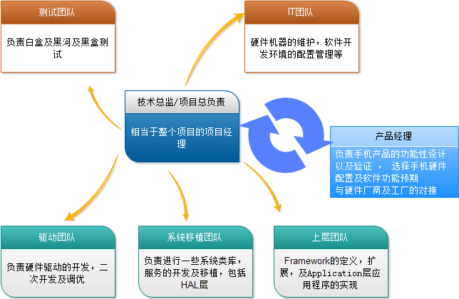
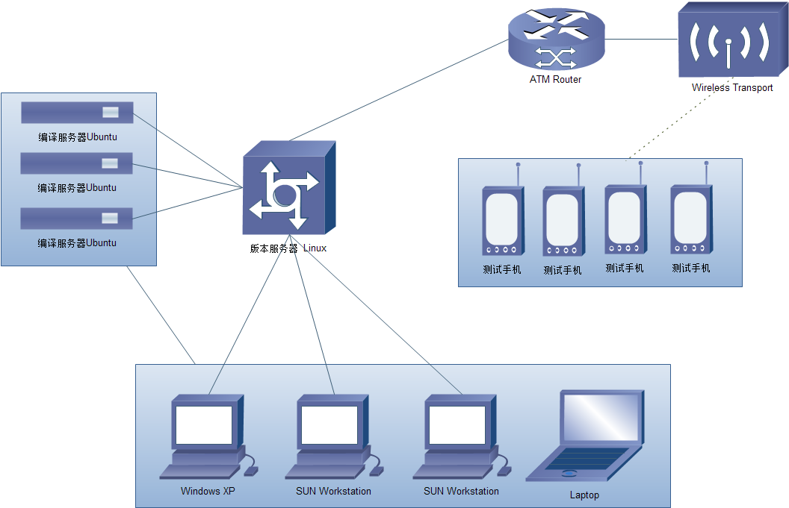

# what is the board support package (BSP)? 

In embedded systems, a board support package (BSP) is implementation specific support code for a given board that conforms to a given operating system. It is commonly built with a bootloader that contains the minimal device support to load the operating system and device drivers for all the devices on the board. Some suppliers also provide a root file system, a toolchain for making programs to run on the embedded system (which would be part of the architecture support package), and configurators for the devices (while running).
对于一个给定的嵌入式平台，如ARM平台，他们的硬件电路的资源是不尽相同的，要在各种不同的ARM板子上都要跑一个给定的operating system（os),如linux。BSP就是介于主板硬件和操作系统之间的一层，应该说是属于操作系统的一部分,主要目的是为了支持操作系统，使之能够更好的运行于硬件主板上。BSP是相对于操作系统而言的，不同的操作系统对应于不同定义形式的BSP,例如VxWorks的BSP和Linux的BSP相对于某一CPU来说尽管实现的功能一样，可是写法和接口定义是完全不同的，所以写BSP一定要按照该系统BSP的定义形式来写（BSP的编程过程大多数是在某一个成型的BSP模板上进行修改）。这样才能与上层OS保持正确的接口，良好的支持上层OS。
通常BSP包是由开发板的公司提供的，它一般包含有一个底层的bootloader,如Das U-Boot，里面实现了少量的设备驱动，如串口，网络等等，用以在加载kernel时用到。它还包括给kernel用的所有的板上设备的驱动程序。有一些供应商BSP甚至还提供了root file system、一个完整的tool chain，用以开发程序、用于系统在运行时的系统配置程序
This term has been in use since about 1988 when VRTX used the term. The origin of the phrase is most commonly attributed to Wind River Systems for its VxWorks  embedded operating system because of its extensive device driver offerings, but it is in wider use in the industry now. For example, QNX Software Systems also distributes BSPs, as does Microsoft (for its Windows CE operating system).
BSP这个概念最初是在1988时 VRTX RTOS中提出的，不过大家一般都认为是Wind River 的VxWorks 中的，现在已经作为一个通用的说法了，例如QNX也发布自己的BSP，Microsoft的WINCE也有自己的BSP。

补：    
Versatile Real-Time Executive (VRTX) is a real-time operating system nowadays developed and marketed by the company Mentor Graphics. VRTX is suitable for both traditional board-based embedded systems and SoC architectures.
多功能实时执行（VRTX）是由Mentor Graphics公司开发和销售，它既适合传统的板级的嵌入式系统（就是由多个接口板组成的系统），也适合现在流行的SoC的结构。

The VRTX operating system began as a product of Hunter & Ready, a company founded by James Ready and Colin Hunter in 1980 which later became Ready Systems. This firm later merged with Microtec Research in 1993 and went public in 1994. This firm was then acquired by Mentor Graphics in 1995 and VRTX became a Mentor product.

VRTX comes in two flavors: VRTXmc (micro-controller) for small systems requiring minimal memory use and VRTXsa (scalable architecture) for full operating system features. 

Most companies developing software with VRTX use ARM, MIPS, PowerPC or other RISC microprocessors.
支持多个体系结构。
VRTX runs the Hubble Space Telescope.
哈勃望远镜中用的就是它。

# **模拟企业的开发环境**

## **团队结构**

一般一个普通的公司研发一款手机只需要30人左右的研发规模即可在6-8个月完成研发工作

## 环境配置

版本服务器： 1-2 台 4核 16G ， 10T以上， Linux 64位，不安装图形XWindow
编译服务器： 3-5 台 ， 4核 ， 16G ， 10T 以上 ， Linux64位 ，不安装XWindow
开发终端机： 每个程序员使用的电脑
测试手机： 越多越好，最好保证人手一台 ， 包括sd卡要充足（当然现在手机都内置NandFlash了）
网络信号覆盖： Wifi ， Bluetooth , 3G 等网络覆盖 
各种外设齐全 

我们搭建的讲课环境：
内部版本服务器：HPZ210 工作站 ， i5四核 ， 10G内存， 500G硬盘 ， 64bit UBuntu no XWindow

工作机： Mac air i7 ，4G内存 ，Windows操作系统开发环境（双系统）

测试手机： Galaxy Nexus 德州仪器OMAP4460双核1.2G ，1G Ram ， 16G ROM 4.6inch

实验开发板：Tiny210(A8架构）-中端 ， TQ2440（ARM9架构）-低端
    

 

 

方法一：
采用单位时间内平均执行指令条数来衡量：
单位：
MIPS（Million of Instruction Per Second)
每秒执行多少百万条指令
方法二：
主频及时钟频率， 指计算机的CPU在单位时间内发出的脉冲数
单位:
MHz（兆赫兹）
注意：目前芯片技术不能无限的提高主频，因为有功耗大等负面作用，所以现在开始双核，四核，相信未来还有8核，16核