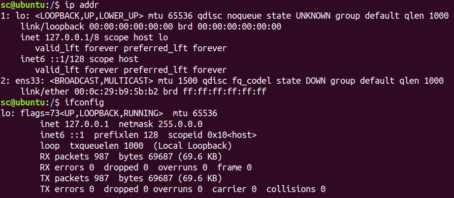
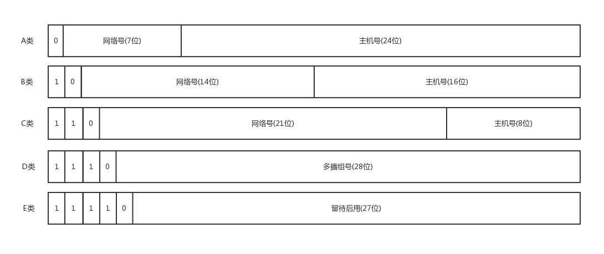
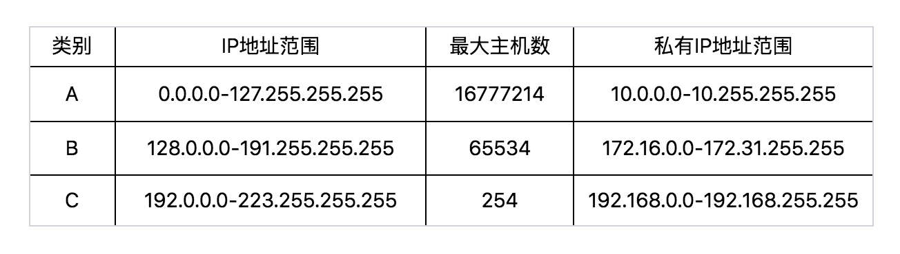

#### ifconfig 最熟悉的陌生人

> windows: ipconfig
>
> Linux: ifconfig
>
> Linux: ip addr

##### IPv4：总共32位

	有个尴尬的事清，就是C类地址能包含的最大主机数量实在太少了，只有 254个。 当时设计的时候恐怕没想到，现在估计一个网吧都不够用吧。 而 B 类地址能包含的最大主机数量又太多了。 6万多台机器放在一个网络下面，一般的企业基本达不到这个规模，闲着的地址就是浪费。
##### 无类型域间选路(CIDR)

​	于是有了一个折中的方式叫作无类型域间选路，简称CIDR。这种方式打破了原来设计的几类地址的做法，将32位的IP地址一 分为二，前面是网络号，后面是主机号。 从哪里分呢？你如果注意观察的话可以看到， 10.100.122.2/24, 这个IP地址中有一个斜杠，斜杠后面有个数字24。 这种地址表示形式，就是 CIDR。

> 24 的意思：32位中，前24位是网络号，后8 位是主机号

​	如果发送这个地址 10.100.122.255 ，所有 10.100.122 网络里面的机器都可以收到。 另一个是子网掩码，255.255.255.0 将子网掩码和IP地址进行AND 计算。 前面三个255, 转成二进制都是1 。 1 和任何数值取AND, 都是原来数值，因而前三个数不变，为10.100.122 。后面一个0, 转换成二进制是0, 0和任何数值取AND, 都是0, 因而最后一个数变为0, 合起来就是10.100.122.0 。 这就是网络号。 

> 将子网掩码和IP地址按位计算AND, 就可得到网络号

##### **公有IP地址 和 私有IP地址**

在日常的工作中，几乎不用划分A类、 B类或者C 类，所以时间长了，很多人就忘记了这个分类，而只记得CIDR 。但是有一点还是要注意的，就是公有IP地址和私有IP地址。

我们继续看上面的表格。 表格最右列是私有IP地址段。 平时我们看到的数据中心里，办公室、 家里或学校的IP地址，一般都是私有IP地址段。 因为这些地址允许组织内部的IT人员自己管理 自己分配，而且可以重复。 因此，你学校的某个私有IP地址段和我学校的可以是一样的。

不需要将十进制转换为二进制32位，就能明显看出192.168.0 是网络号，后面是主机号。 而整 个网络里面的第一个地址192.168.0.1, 往往就是你这个私有网络 的出口地址。 例如，你家里的电脑连接Wi-Fi, Wi-Fi路由器的地址就是192.168.0.1, 而192.168.0.255 就是广播地址。 一 旦发送这个地址，整个192.168.0 网络里面的所有机器都能收到。

**MAC地址更像是身份证，是一个唯一的标识。** 它的唯一性设计是为了组网的时候，不同的网卡放在一个网络里面的时候，可以不用担心冲突。 从硬件角度，保证不同的网卡有不同的标识。

例如，你去杭州市网商路599号B楼6层找刘超，你在路上间路，可能被问的人不知道B楼是哪个，但是可以给你指网商路怎么去。 但是如果你问—个人，你知道这个身份证号的人在哪里吗？可想而知，没有人知道。

##### et_device flags 网络设备的状态标识

UP表示网卡处于启动的状态； 

BROADCAST表示这个网卡有广播地址，可以发送广播包；

MULTICAST表示网卡可以发送多播包； 

LOWER_UP表示 L1是启动的，也即网线插着呢。 

MTU1500是指什么意思呢？是哪一层的概念呢？最大传输单元MTU为 1500 , 这是以太网的默认值。

qdisc pfifo _fast 是什么意思呢? qdisc 全称是 queueing discipline, 中文叫排队规则。 内核如果需要通过某个网络接口发送数据包，它都需要按照为这个接口配置的 qdisc (排队规则）把数据包加入队列。
最简单的 qdisc 是 pfifo, 它不对进入的数据包做任何的处理，数据包采用先入先出的方式通过队列。 pfifo_fast 稍微复杂一些，它的队列包括三个波段 (band) 。在每个波段里面，使用先 进先出规则。
三个波段 (band) 的优先级也不相同。 band 0 的优先级最高，band 2 的最低。如果 band 0 里面有数据包，系统就不会处理 band 1 里面的数据包，band 1 和 band 2 之间也是一样。数据包是按照服务类型(Type of Service, TOS)被分配多三个波段(band)里面的。 TOS是IP头里面的一个字段，代表了当前的包是高优先级的，还是低优先级的。

##### 小结

怎么样，看起来很简单的一个命令，里面学问很大吧？通过这 一节，希望你能记住以下的知识点，后面都能用得上：

IP 是地址，有定位功能； MAC 是身份证，无定位功能；
CIDR可以用来判断是不是本地人；
IP分公有的IP和私有的IP。 后面的章节中我会谈到 “出国门” ，就与这个有关。